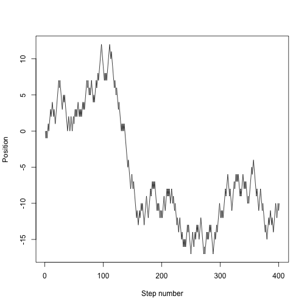

<!-- Goals
- learn how to key control structures
 -->

**Materials**: If you have not already done so, please [download the lesson materials for this bootcamp](https://github.com/dbarneche/2014-10-31-USyd/raw/gh-pages/data/lessons.zip), unzip, then go to the folder `control-flow`, and open (double click) on the file `control-flow.Rproj` to open Rstudio.

Often when we're coding we want to control the flow of our actions. Control flow (or flow of control) is simply the order in which we code and have our statements evaluated. That can be done by setting things to happen only if a condition or a set of conditions are met. Alternatively, we can also set an action to be computed for a particular number of times. 

## Conditional statements

There are many ways these can be achieved in R. For conditional statements, the most commonly used approaches are the constructs: 

```
if (and else)
while
```

Say, for example, that we want R to print a message depending on how a number x relates to 5:

```
set.seed(10)
x <- rpois(1, lambda=8)
if (x >= 5) {
    "x is greater than or equals 5"
} else {
    "x is smaller than 5"
}
```

```
## [1] "x is greater or equal than 5"
```

In the above case, the function `rpois` generates a random number following a Poisson distribution with a mean (i.e. lambda) of 8. The function `set.seed` guarantees that all machines that use the seed 10 as an input, will generate the exact same 'pseudo-random' number ([more about pseudo-random numbers](http://en.wikibooks.org/wiki/R_Programming/Random_Number_Generation)). Now, looking at at x we see that it takes the value 8 (you should get the exact same number).

```
x
```

```
## [1] 8
```

**Important:** when R evaluates the condition inside `if` statements, it is looking for a logical element, i.e., `TRUE` or `FALSE`. This can cause some headache for beginners. For example:

```
x  <-  4 == 3
if (x) {
    "4 equals 3"
}
```

As we can see, the message was not printed because the vector x is `FALSE` 

```
x  <-  4 == 3
x
```

```
## [1] FALSE
```

Also, be careful if you a vector with more than one logical elements, the function `if` will still run, but will only evaluate the condition of first element 

```
set.seed(1)
x  <-  round(rnorm(30, mean=15, sd=15))
y  <-  x %in% c(3, 5, 16)

if(y) {
  stop('at least one number in x was found within the sequence c(3, 5, 16)')
}
```

You can see that R does not return any result but instead prints a warning message. 

```
## Warning message:
## In if (y) { :
##   the condition has length > 1 and only the first element will be used
```

The reason for that is because the first element in `y`, `y[1]` is `FALSE` (i.e. `x[1]` is 6 and therefore is not contained within `c(3, 5, 16)`), so the action within the condition is not evaluated. Such cases where multiple comparisons/logical statements are contained within one single vector are not uncommon, and I suspect you are probably looking for the functions `any` or `all` before running an `if` statement. `any` will return TRUE if at least one TRUE value is found within a vector, otherwise will return `FALSE`. The function `all`, as the name suggests, will only return `TRUE` if all values in the vector are `TRUE`. We can build on the above example to make this clear - suppose that we want to make sure that we avoid the warning message, and, on top of that, print a more informative message:

```
if(any(y)) {
  stop(paste0(paste0(x[y], collapse=' and '), ' found in x'))
}
```

Notice that now returns an Error message

```
## Error: 3 and 16 found in x
```

The reason for that is because the function `stop` was evaluated. This function is widely used in what's known as *defensive programming* - if you anticipate a potential problem in your data manipulation/analysis within a function, the function can stop if this certain problem occurs and print an informative error message. The same idea works for the function `warning`. We could have also created the different statements with the function `all` instead of `any`. Try that by yourself. 

### Exercise
Using the gapminder dataset, create a function called `subsetAndEvaluateLifeExp` that subsets the data to a given year and continent, and return the average population size among countries if their life expectancy are all above 40 years, otherwise return a message saying what countries had their life expectancy below 40 years. Evaluate this function for Asia in 1967, 1977, 1987, 1997 and 2007. *Hint:* use the function `subset` within your function to subset the data - type `?subset` on the console for examples.

In what years did the condition *life expectancy > 40* occur?

# Repeating operations

## For loops - when the order of operation is important

When you mention looping, many people immediately reach for `for`. Perhaps
that's because they are already familiar with these other languages,
like basic, python, perl, C, C++ or MATLAB. While `for` is definitely the most
flexible of the looping options, we suggest you avoid it wherever you can in favor of functions in plyr and the like, for the following two reasons:

1. It is not very expressive, i.e. takes a lot of code to do what you want.
2. It permits you to write horrible code that is hard to read and debug.

In fact, we'd encourage you to avoid `for` unless the order of iteration is important. A key feature of all the examples in the `plyr` section is that **order of iteration is not important**.  This is crucial. If each iteration is independent, then you can cycle through them in whatever order you like.

When the order of iteration **is** important, we can use loops.  The basic structure of a `for` loop is 

```r
for(iterator in set of values){
  do a thing
}
```
For example:

```r
for(i in 1:10){
  print(i)
}
```

The `1:10` bit is basically just creating a vector on the fly; you can iterate over any other vector as well.

```r
v <- c("this", "is", "the", "world's", "greatest", "for", "loop")
for(i in v){
  print(i)
}
```
One of the most important issues with `for` loops is execution time.  Some operations can really slow down a for loop if they're done in every iteration.  For instance, take the following code:

```r
vec  <-  numeric()
system.time(
  for(i in seq_len(50000-1)) {
    calculation  <-  sqrt(i + (i+1)/10)
    vec  <-  c(vec, calculation)
  }  
)
```

###    user  system elapsed 
###    5.510   0.588   6.098 

That takes about five and a half seconds to run.  It turns out that most of that time is taken up with the concatenation step.  If we get rid of that step by allocating a vector of the correct size to start with and accessing elements of that vector directly, it runs much faster.

```r
iter  <-  50000
vec  <-  numeric(length=iter)
system.time(
  for(i in seq_len(iter-1)) {
    calculation  <-  sqrt(i + (i+1)/10)
    vec[i]           <-  calculation
  }
)
```

###   user  system elapsed 
###   0.091   0.002   0.092 

That took about 1/6 as long to do the same thing!  We can shave off even more time by removing the `calculation` variable and allocating the results of each step directly to the vector with no intermediaries.

```r
iter  <-  50000
vec   <-  numeric(length=iter)
system.time(
    for(i in seq_len(iter-1)) {
        vec[i] <- sqrt(i + (i)/10)
    }
)
```
###   user  system elapsed 
###   0.077   0.001   0.078 

This version even compares favorably with the execution time we achieve using apply!

```r
system.time(
    sapply(seq_len(iter), function(x)sqrt(x + (x)/10))
)
```
###   user  system elapsed 
###   0.071   0.001   0.072 

## Nested for loops

We can use a for loop within another for loop to iterate over two things at once (e.g., rows and columns of a matrix).

```r
for(i in 1:5){
  for(j in 1:5){
    print(paste(i,j))
  }
}
```

Note the variable scoping - `i` is visible from within the `j` loop.  What happens when we try to print `j` from outside the `j` loop?

## While loops

Sometimes you will find yourself needing to repeat an operation until a certain condition is met, rather than doing it for a specific number of times.  In some cases you might be able to hack something together using a `for` loop, but usually you'd be much better off using a `while` loop instead.  `While` loops look and act a lot like `for` loops, but instead of saying: 

```r
for(iterator in set of values){
  do a thing
}
```

You instead say:

```r
while(this condition is true){
  do a thing
} 
```

Let's try an example, shall we?  We'll try to come up with some simple code that generates random numbers between 0 and 1 until it gets one that's less than 0.1.  

```r
while(z > 0.1){
  z <- runif(1)
  print(z)
}
```

But wait, that doesn't work!  What's the problem?

The problem is that we haven't defined `z`, and so the very first time the while loop's condition is checked (`z > 0.1`), `while` just says "Okay, that's not true so I'm not going to execute this block of code".  The same thing would have happened if we defined `z` to be anything less than 0.1.  Let's fix it.

```r
z <- 1
while(z > 0.1){
  z <- runif(1)
  print(z)
}
```

## 

### Exercise

Let's say you want to know how many random numbers you need to draw until you get one that's below a given threshold (i.e., "how many random numbers before I get one less than 0.1?")  Let's create a simulation of that procedure!

1. Create a function `randbelow` that takes a threshold and uses a `while` loop to draw random (`runif`) numbers until it gets a number below the threshold, counting each time it draws a number.

2. Create a function that takes a threshold and the number of reps and uses a `for` loop to call `randbelow`.  You'll need to define an empty numeric vector, e.g., `results <- numeric()` and append results to it, e.g., `results <- c(results, thisresult)` each iteration.

3. Finally, use the results vector from that function to draw and return a histogram.

Let's experiment!  See what the distribution looks like if you try to draw numbers under 0.1 for 100 repetitions.  What about 0.01?  Keep adding zeros (0.001, 0.0001, 0.00001).  What happens to the time it takes to execute your simulation?  Why?

This demonstrates an important part of using loops in code - if you don't think clearly about what you're doing, they can take a long time to execute, or can even go on forever! 


## Loops in simulations

One place where `for` loops shine is in writing simulations; if one iteration depends on the value of a previous iteration, then a `for` loop is probably the best way of repeating things.

In an (unbiased) random walk, each time step we move left or right with probability 0.5.  R has lots of random number generation functions.  The `runif` function generates random numbers uniformly on `[0,1]` so we can draw random steps directions like this:


```r
set.seed(1)
for (i in 1:10){
  step <- 0
  if(runif(1) < 0.5){
    step <- 1
  }
  else{
    step <- -1
  }
  print(step)
}
```

```
## [1] 1
## [1] 1
## [1] -1
## [1] -1
## [1] 1
## [1] -1
## [1] -1
## [1] -1
## [1] -1
## [1] 1
```


Or we could take the `sign` of a standard normal:


```r
set.seed(1)
for (i in 1:10){
  print(sign(rnorm(n=1, mean=0)))
}
```

```
## [1] -1
## [1] 1
## [1] -1
## [1] 1
## [1] 1
## [1] -1
## [1] 1
## [1] 1
## [1] 1
## [1] -1
```


The implementation does not matter.  Now let's wrap that in a function.


```r
random.step <- function() {
  sign(rnorm(n=1, mean=0))
}
```


We can then use this to step 20 steps:


```r
set.seed(1)
x <- 0
for (i in 1:20){
  x <- x + random.step()
}
x
```

```
## [1] 4
```


which will end up somewhere between -20 and 20, but with a mean of 0.

We want to track the entire trajectory:


```r
set.seed(1)
nsteps <- 200
x <- numeric(nsteps + 1) # space to store things in
x[1] <- 0 # start at 0
for (i in seq_len(nsteps)) {
  x[i+1] <- x[i] + random.step()
}
plot(x, type="l", xlab="Step number", ylab="Position")
```


We might want to run that lots of times, so put it into a function:

```r
random.walk <- function(nsteps, x0=0) {
  x <- numeric(nsteps + 1)
  x[1] <- x0
  for (i in seq_len(nsteps)) {
    x[i+1] <- x[i] + random.step()
    }
  x
}
```


which is now much easier to use:


```r
set.seed(1)
plot(random.walk(400), type="l", xlab="Step number", ylab="Position")
```




```r
set.seed(1)
nsteps <- 200
nrep <- 40
cols <- rainbow(nrep)
plot(NA, xlim=c(1, nsteps+1), ylim=c(-30, 30), xlab="Step number", ylab="Position")
for (i in 1:nrep){
  lines(random.walk(200), col=cols[i])
}
```


## Acknowledgements

This material was developed by Daniel Falster and Rich FitzJohn and modified by Diego Barneche and Dan Warren. Based on material prepared by Karthik Ram and Hadley Wickam.
