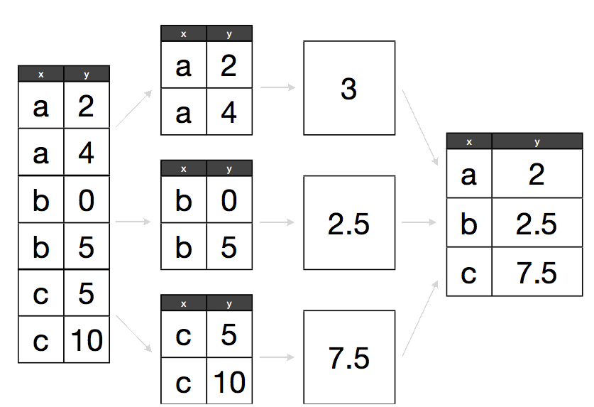
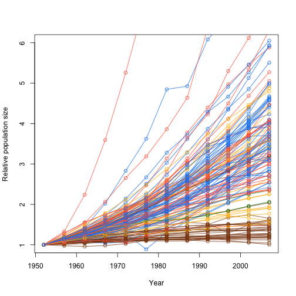

<!-- Goals
- split apply combine strategy for data analysis
 -->

**Materials**: If you have not already done so, please [download the lesson materials for this bootcamp](https://github.com/dbarneche/2014-10-31-USyd/raw/gh-pages/data/lessons.zip), unzip, then go to the folder `repeating`, and open (double click) on the file `repeating.Rproj` to open Rstudio.


Previously we looked at how you can use functions to simplify your code. Ideally you have a function that performs a single operation, and now you want to use it many times to do the same operation on lots of different data. The naive way to do that would be something like this:

```r
  res1 <-  f(input1)
  res2 <-  f(input2)
  ...
  res10 <-  f(input10)
```

But this isn't very *nice*. Yes, by using a function, you have reduced a substantial amount of repetition. That **is** nice. But there is still repetition. Repeating yourself will cost you time, both now and later, and potentially introduce some nasty bugs. When it comes to repetition in code: ***Don't***.

<blockquote class="twitter-tweet" lang="en"><p>The more code I read, the more I realize the need to keep repeating: Keep it DRY! Don&#39;t. Repeat. Yourself. <a href="http://t.co/8lDtck2jZO">http://t.co/8lDtck2jZO</a></p>&mdash; Ben Simo (@QualityFrog) <a href="https://twitter.com/QualityFrog/statuses/363789702458904577">August 3, 2013</a></blockquote>
<script async src="//platform.twitter.com/widgets.js" charset="utf-8"></script>

The nice way of repeating elements of code is to use a loop of some sort. A loop is a coding structure that reruns the same bit of code over and over, but with only small fragments differing between runs. In R there is a whole family of looping functions, each with their own strengths.

## R's built-in apply library

R has a list of built-in functions for repeating things. This includes a range of functions that allow you to apply some function to a series of objects (eg. vectors, matrices, dataframes or files). This is called the apply family, and includes: `lapply`,  `sapply`,  `tapply`, `aggregate`, `mapply`, `apply`.

Each repeats a function or operation on a series of elements, but they differ in the data types they accept and return.


## The split-apply-combine pattern

By now you may have recognised that most operations that involve looping are instances of the *split-apply-combine* strategy (this term and idea comes from the prolific [Hadley Wickham](http://had.co.nz/), who coined the term in [this
paper](http://vita.had.co.nz/papers/plyr.html)). You start with a bunch of data. Then you then **Split** it up into many smaller datasets, **Apply** a function to each piece, and finally **Combine** the results back together.

Some data arrives already in its pieces - e.g. output files from from a leaf scanner or temperature machine. Your job is then to analyse each bit, and put them together into a larger data set.

Sometimes the combine phase means making a new data frame, other times it might mean something more abstract, like combining a bunch of plots in a report. 

Either way, the challenge for you is to identify the pieces that remain the same between different runs of your function, then structure your analysis around that.




## The `plyr` package

While R's built in function do work, we're going to introduce you to another method for repeating things using the package [**plyr**](http://had.co.nz/plyr/). plyr is an R Package for Split-Apply-Combine workflows.  Its functional
programming model encourages writing reusable functions which can be called
across varied datasets and frees you from needing to manage for loop indices.

You can load plyr as

```r
install.packages("plyr")
library(plyr)
```

plyr has functions for operating on `lists`, `data.frames` and `arrays`.  Each
function performs:

1. A **split**ting operation
2. **Apply** a function on each split in turn.
3. Re**combine** output data as a single data object.

The functions are named based on which type of object they expect as input
([a]rray, [l]ist or [d]ata frame) and which type of data structure should be
returned as output. Note here that plyr's use of "array" is different to R's, an array in ply can include a vector or matrix.

This gives us 9 core functions **ply.  There are an additional three functions
which will only perform the split and apply steps, and not any combine step.
They're named by their input data type and represent null output by a `_` (see
table)


### Understanding xxply

Each of the xxply functions (`daply`, `ddply`, `llply`, `laply`,...) has the same structure and has 4 key features and structure:

```r
xxply(.data, .variables, .fun)
```

* The first letter of the function name gives the input type and the second gives the output type.
* .data - gives the data object to be processed
* .variables - identifies the splitting variables
* .fun - gives the function to be called on each piece

### Example

For an example, let's pull up gapminder dataset as before

```r
data <- read.csv("data/gapminder-FiveYearData.csv", stringsAsFactors=FALSE)
```

Now, what is we want to know is the number of countries by continent. So let's make a function that takes a dataframe as input and returns the number of countries.

**Why don't you try - hint, function unique**

```r
get.n.countries <- function(x) length(unique(x$country))
get.n.countries(data)
```

So first do it hard way:

```r
data.new <- data[data$continent == "Asia",]
Asia.n <- get.n.countries(data.new)

data.new <- data[data$continent == "Africa",]
Africa.n <- get.n.countries(data.new)

data.new <- data[data$continent == "Europe",]
Europe.n <- get.n.countries(data.new)

data.new <- data[data$continent == "Oceania",]
Oceania.n <- get.n.countries(data.new)

data.new <- data[data$continent == "Americas",]
Americas.n <- get.n.countries(data.new)

n.countries <- c(Africa.n, Asia.n, Americas.n, Europe.n, Oceania.n)
```

Now here's the equivalent in plyr:

```r
daply(data, .(continent), get.n.countries)
```

Isn't that nice? A single line of code, easy to read.

Let's look at what happened here

- The `daply` function feeds in a `data.frame` (function starts with **d**) and returns an `array` (2nd letter is an **a**)
- the first argument is the data we are operating on: `data`
- the second argument indicates our split criteria `continent`
- the third is the function to apply `get.n.countries`

Instead of `daply` we could also use `ddply` of `dlply`. Which to use? You need to decide which type of output is most useful to you, i.e. a `list`, `array` or `data.frame`

It's also possible to define the function in place as an [anonymous function](http://adv-r.had.co.nz/Functional-programming.html):

```r
ddply(data, .(continent), function(x) length(unique(x$country)) )
```

Finally, there's several ways we can represent the split argument:

- using the funky plyr notation: `daply(data, .(continent), get.n.countries)`
- as a character: `daply(data, "continent", get.n.countries)`
- or as a formula: `daply(data, ~continent, get.n.countries)`.
```

**Now let's try another example**.

We want to sum total population in a dataframe.

First write the function:

```r
get.total.pop <- function(x) sum(x$pop)
```
Then apply it using `daply`, `ddply` and `dlaply`:

```r
ddply(data, .(continent), get.total.pop)
```
Anyone notice a problem here? Yes, the total population of the world is about 10 times too big because it's repeated every 5 years. So we need to add `year` to our list of splitting criteria

```r
ddply(data, .(continent, year), get.total.pop)
```

**You try**
Next we want the maximum `gdpPercap` on each continent.

```r
ddply(data, .(continent, year), function(x) max(x$gdpPercap))
```

### An example returning a list

Sometimes we want to return something that doesn't fit into a dataframe or vector; in that case you should return a list. so in this case we'll want to use `dlply` because we're putting a dataframe in and getting a list out.

See if you can write a function that given a dataframe, returns a vector of countries.

```r
get.countries <- function(x) unique(x$country)
```

Now let's apply it to the whole dataset

```r
get.countries(data)
```

And then apply to each continent using `dlpy`

```r
countries <- dlply(data, .(continent), function(x) unique(x$country))
```

### Feed data into model one-by-one returning fits to a list of models

Ok, now it gets really fun.

In each year, we want to fit a model for each continent on the relationship between life expectancy and gdp per capita (as we did in functions section).

First, see if you can write a function that given a data frame `x` fits a model to data

```r
model <- function(x){
  lm(lifeExp ~ log10(gdpPercap), data=x)
}
```

Now let's try it on a subset of data

```r
fit <- model(data[data$year==1982 & data$continent =="Asia" ,])
```
Ok, so let's apply it to all continents in all years:

```r
fitted.linear.model <- dlply(data, .(continent, year), model)
```

The output `fitted.linear.model` is a list of fitted models, with same structure as `fit`. We can use the `coef` function to extract coefficients of a model :

```r
coef(fitted.linear.model[[1]])
ldply(fitted.linear.model, coef)
```

You probably want the R2 too right?

```r
ldply(fitted.linear.model, function(x) summary(x)$r.squared)
```

We could also alter our model function to return the desired output then call `ddply` to get a summary for models fitted by year and continent:

```r
model <- function(x){
  fit <- lm(lifeExp ~ log10(gdpPercap), data=x)
  data.frame(n=length(x$lifeExp), r2=summary(fit)$r.squared, a=coef(fit)[[1]], b=coef(fit)[[2]])
}
ddply(data, .(continent,year), model)
```

As a final extension, we could add the variables we want to fit to the function definition, so that we could fit other combinations.

```r
model <- function(d, x, y) {
  fit <- lm( d[[y]] ~ log10(d[[x]]) )
  data.frame(n=length(d[[y]]), r2=summary(fit)$r.squared,a=coef(fit)[1],b=coef(fit)[2])
}
ddply(data, .(continent,year), model, y="lifeExp", x="gdpPercap")
ddply(data, .(continent,year), model, y="lifeExp", x="pop")
```

So there you have it - in just 6 lines we can fit about 120 linear models and return two tables summarising these models. That's why plyr rocks!

### Simplifying plots with plyr

We can also exploit `plyr`'s ability to repeat things when generating plots. In the section on functions we used a function to help us add trend lines by continent:

```r
add.trend.line <- function(x, y, d, ...) {
  fit <- lm(d[[y]] ~ log10(d[[x]]))
  abline(fit, ...)
}
```

But we still had to run all this code to fit lines to each continent:

```r
data.1982 <- data[data$year == 1982,]

col.table <- c(Asia="tomato", Europe="chocolate4", Africa="dodgerblue2", Americas="darkgoldenrod1", Oceania="green4")

plot(lifeExp ~ gdpPercap, data.1982, log="x", cex=rescale(sqrt(data.1982$pop), c(0.2, 10)), col= colour.by.category(data.1982$continent, col.table), pch=21)
plot(lifeExp ~ gdpPercap, data.1982, log="x", cex=cex, col=col, pch=21)
add.trend.line("gdpPercap", "lifeExp", data.1982[data.1982$continent == "Asia",], col=col.table["Asia"])
add.trend.line("gdpPercap", "lifeExp", data.1982[data.1982$continent == "Africa",], col=col.table["Africa"])
add.trend.line("gdpPercap", "lifeExp", data.1982[data.1982$continent == "Europe",], col=col.table["Europe"])
add.trend.line("gdpPercap", "lifeExp", data.1982[data.1982$continent == "Americas",], col=col.table["Americas"])
add.trend.line("gdpPercap", "lifeExp", data.1982[data.1982$continent == "Oceania",], col=col.table["Oceania"])
```

That's a lot of typing that is really very similar, and the sort of thing that is (a) boring to type, (b) prone to errors, and (c) hard to change (e.g. if we wanted to run it on a different data set, or change which continents we ran it over etc).


One way to avoid repetition is to pass the `add.trend.line` function into `d_ply`. The underscore in `d_ply` tells us that we don't want any output, we just want to run the function


```r
# recall functions and objects created in the functions lesson
colour.by.category <- function(x, table) {
  unname(table[x])
}

rescale <- function(x, r.out) {
  p <- (x - min(x)) / (max(x) - min(x))
  r.out[[1]] + p * (r.out[[2]] - r.out[[1]])
}

col <- colour.by.category(data.1982$continent, col.table)
cex <- rescale(sqrt(data.1982$pop), c(0.2, 10))

# now use function add.trend.line
plot(lifeExp ~ gdpPercap, data.1982, log="x", cex=cex, col=col, pch=21)
d_ply(data.1982, .(continent), function(x) add.trend.line("gdpPercap", "lifeExp", x, col=col.table[x$continent]))
```


**Another example**
Plyr really shines when there are many things to deal with at once.  For example, we plotted relative population growth by country for three countries before:

```r
pop.by.country.relative <- function(country, data, base.year=1952) {
  dsub <- data[data$country == country, c("year", "pop")]
  dsub$pop.rel <- dsub$pop / dsub$pop[dsub$year == base.year]
  dsub
}

plot(pop.rel ~ year, pop.by.country.relative("India", data), type="o")
lines(pop.rel ~ year, pop.by.country.relative("Australia", data), type="o", col="green4")
lines(pop.rel ~ year, pop.by.country.relative("China", data), type="o", col="red")
```

But if we wanted to do this for, say, all the countries in Asia that'd be a lot of copy and paste.  With plyr this is easy. Let's make a function that plot's a growth function for all years within a dataset:

```r
add.growth.line <- function(x, base.year,...){
	lines(x$year,x$pop / x$pop[x$year == base.year], type="o",...)
}
```
We can then feed this into `d_ply` to generate  a plot for all countries

```r
plot(NA, type="n", xlim=range(data$year), ylim=c(1, 6), xlab="Year", ylab="Relative population size")
d_ply( data[data$continent =="Asia" ,], .(country), function(x) add.growth.line(x, 1952))
```


And we could use the same approach to make plots for the entire world, colouring by continent

```r
plot(NA, type="n", xlim=range(data$year), ylim=c(1, 6), xlab="Year", ylab="Relative population size")
d_ply(data, .(country), function(x) add.growth.line(x, 1952, col=col.table[x$continent]))
```



### Summarise

Above we showed you how you can apply a function to your dataframe using the plyr package. But what if you want to apply a whole bunch of functions? For example, what if you want to find the `min`, `max`, `mean`, and `var` of each group - surely we don't have to run each one of these separately?

There are two options for running multiple functions on a data frame:

1. The first is to write your own "wrapper" function returning multiple outputs as a data frame, like we did in the the above section fitting models.
2. The other option is to use the summarise function.

Like `ddply`, `summarise` can be used to create a new data frame from another data frame. It's particularly useful when you want multiple outputs.

For summaries of the whole dataset you can call summarise directly:

```r
summarise(data, pop.mean=sum(pop), pop.var=var(pop), pop.max=max(pop))
```

But if you want to split by groups, need to combine with `ddply`. All the functions you want to call are simply listed at the end as extra arguments:

```r
ddply(data, .(continent, year), summarise, pop.mean=sum(pop), pop.var=var(pop), pop.max=max(pop))
```

However, notice that the format of the functions is slightly different to if we were calling each directly with ddply:

```r
ddply(data, .(continent, year),  function(x) sum(x$pop))
ddply(data, .(continent, year),  function(x) var(x$pop))
ddply(data, .(continent, year),  function(x) max(x$pop))
```

## Acknowledgements

This material was developed by Daniel Falster and Rich FitzJohn and modified by Diego Barneche. Based on material prepared by Karthik Ram and Hadley Wickam.
