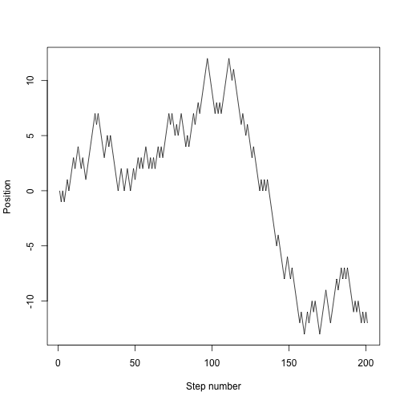
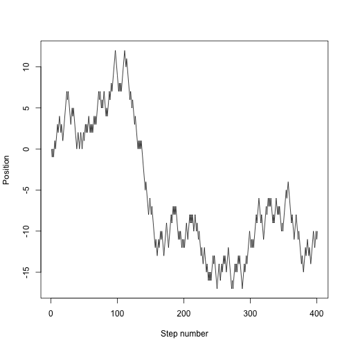

<!-- Goals
- learn how to key control structures
 -->

**Materials**: If you have not already done so, please [download the lesson materials for this bootcamp](https://github.com/dbarneche/2014-10-31-USyd/raw/gh-pages/data/lessons.zip), unzip, then go to the folder `looping`, and open (double click) on the file `looping.Rproj` to open Rstudio.

## For loops - when the order of operation is important

When you mention looping, many people immediately reach for `for`. Perhaps
that's because they are already familiar with these other languages,
like basic, python, perl, C, C++ or MATLAB. While `for` is definitely the most
flexible of the looping options, we suggest you avoid it wherever you can, for
the following two reasons:

1. It is not very expressive, i.e. takes a lot of code to do what you want.
2. It permits you to write horrible code, like [this example from my earlier
   work](ugly)

The main problems with this code are that

- it is hard to read
- all the variables are stored in the global scope, which is dangerous.

All it's doing is making a plot! Compare that to something like this

```r
for (i in unique(Raw$SPP))
  makePlot(i, data = Raw)
```

That's much nicer! It's obvious what the loop does, and no new variables are
created. Of course, for the code to work, we need to define the function `makePlot` which actually makes our plot, but having all that detail off in a
function has many benefits:

- Most of all it makes your code more readable
- Also more reliable, because cleans up work space --> less chance of mutability bugs.

But as you saw above, plotting can also be handled with the `d_ply` functions so we'd suggest you use that, as it enforces good habits.

In fact, we'd encourage you to avoid `for` unless the order of iteration is important. A key feature of all the examples in the `plyr` section is that **order of iteration is not important**.  This is crucial. If each iteration is independent, then you can cycle through them in whatever order you like.

One place where `for` loops shine is in writing simulations; if one iteration depends on the value of a previous iteration, then a `for` loop is probably the best way of repeating things.

In an (unbiased) random walk, each time step we move left or right with probability 0.5.  R has lots of random number generation functions.  The `runif` function generates random numbers uniformly on `[0,1]` so we can draw random steps directions like this:


```r
set.seed(1)
for (i in 1:10)
  print(if (runif(1) < 0.5) 1 else -1)
```

```
## [1] 1
## [1] 1
## [1] -1
## [1] -1
## [1] 1
## [1] -1
## [1] -1
## [1] -1
## [1] -1
## [1] 1
```


Or we could take the `sign` of a standard normal:


```r
set.seed(1)
for (i in 1:10)
  print(sign(rnorm(1)))
```

```
## [1] -1
## [1] 1
## [1] -1
## [1] 1
## [1] 1
## [1] -1
## [1] 1
## [1] 1
## [1] 1
## [1] -1
```


The implementation does not matter.


```r
random.step <- function() {
  sign(rnorm(1))
}
```


We can then use this to step 20 steps:


```r
set.seed(1)
x <- 0
for (i in 1:20)
  x <- x + random.step()
x
```

```
## [1] 4
```


which will end up somewhere between -20 and 20, but with a mean of 0.

We want to track the entire trajectory:


```r
set.seed(1)
nsteps <- 200
x <- numeric(nsteps + 1) # space to store things in
x[1] <- 0 # start at 0
for (i in seq_len(nsteps)) {
  x[i+1] <- x[i] + random.step()
}
plot(x, type="l", xlab="Step number", ylab="Position")
```




We might want to run that lots of times, so put it into a function:

```r
random.walk <- function(nsteps, x0=0) {
  x <- numeric(nsteps + 1)
  x[1] <- x0
  for (i in seq_len(nsteps)) {
    x[i+1] <- x[i] + random.step()
    }
  x
}
```


which is now much easier to use:


```r
set.seed(1)
plot(random.walk(400), type="l", xlab="Step number", ylab="Position")
```




```r
set.seed(1)
nsteps <- 200
nrep <- 40
cols <- rainbow(nrep)
plot(NA, xlim=c(1, nsteps+1), ylim=c(-30, 30), xlab="Step number", ylab="Position")
for (i in 1:nrep)
  lines(random.walk(200), col=cols[i])
```


## Acknowledgements

This material was developed by Daniel Falster and Rich FitzJohn and modified by Diego Barneche. Based on material prepared by Karthik Ram and Hadley Wickam.
